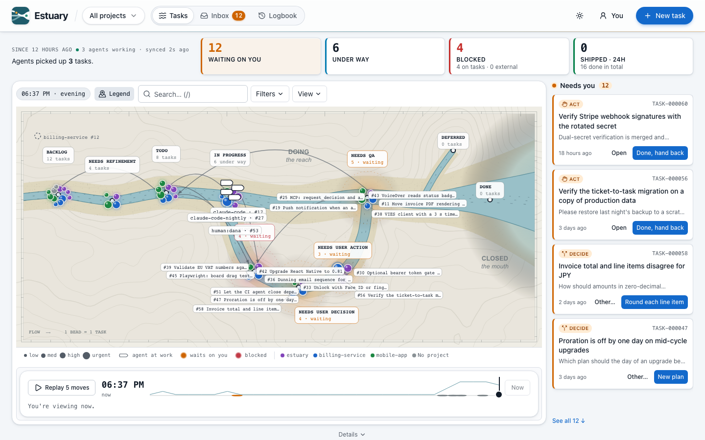
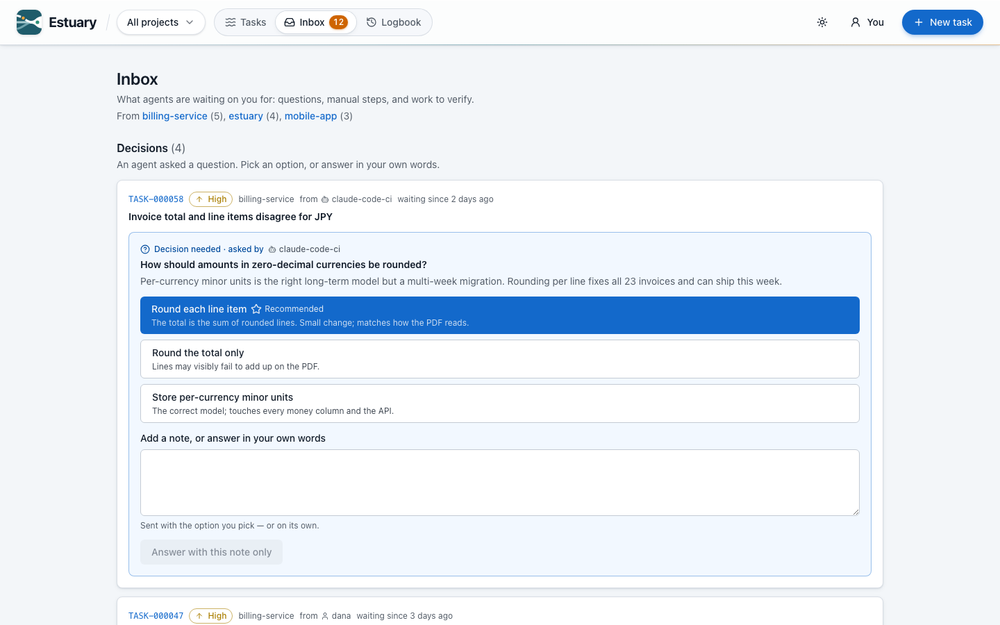

<div align="center">


# Estuary

**A task manager for AI coding agents and the humans working alongside them.**

Agents claim work, ask questions, and hand finished work back for review. You answer from one inbox.

[](https://github.com/krisz4/estuary/actions/workflows/ci.yml)
[](https://www.npmjs.com/package/estuary-mcp)
[](LICENSE)

</div>

<picture>
  <source media="(prefers-color-scheme: dark)" srcset="docs/assets/map-dark.png">
  
</picture>

## Why

Coding agents can now work for hours, and several can run at once. What they're missing is a shared place to keep track of work:

- **Two agents never take the same task.** Claiming a task takes a lease that the agent keeps alive with heartbeats; if the agent dies, the lease runs out and another agent can pick the task up.
- **Agents ask instead of guessing.** An agent stuck on a product call opens a *decision* with options and its recommendation, parks the task, and carries on once you've answered. If it needs a human to *do* something (grant access, test on a device), it asks for that the same way.
- **Humans stay the gate.** By default agents stop at `needs_qa`: they can't mark their own work done.
- **Everything is on the record.** Every change is an event with an actor, so you can see what each agent did and how long work waited on you.

Estuary is self-hosted, runs on one SQLite file, and has no accounts. Agents connect over [MCP](https://modelcontextprotocol.io); humans use the web UI.

## Quick start

### Try it (Docker, seeded with demo data)

```bash
git clone https://github.com/krisz4/estuary.git && cd estuary
docker compose up --build
```

Open http://localhost:5173. The database is seeded with 62 demo tasks across three projects, so every screen has something to show. To run the published images without cloning (starts empty, meant for real use), see [docs/operations/DOCKER.md](docs/operations/DOCKER.md).

### Connect your agent

With an Estuary API running (the Docker setup above serves it at `http://localhost:4000/api/v1`):

```bash
# Claude Code: the plugin (MCP tools + the task-workflow skill + a SessionStart hook)
claude plugin marketplace add krisz4/estuary
claude plugin install estuary@estuary --config api_url=http://localhost:4000/api/v1

# Any other MCP client: the server alone, from npm
npx -y estuary-mcp          # reads TASKS_API_URL, TASKS_ACTOR, TASKS_API_TOKEN
```

Unless you set an actor, each agent acts as `agent:claude-code@<project>`, or `agent:claude-code@<project>/<worktree>` in a linked worktree. That way a resumed session keeps its claims, and parallel worktrees don't take over each other's tasks. Working inside this repo instead? `pnpm --filter estuary-mcp build` and approve the `tasks` server from the repo's `.mcp.json`.

Your agent then has tools like `task_next`, `task_claim`, `task_request_decision`, and `task_submit_for_qa`, and the plugin's `task-workflow` skill teaches it when to use each one. Other MCP clients, self-hosted servers, and every option: [docs/features/Agent_Integration.md](docs/features/Agent_Integration.md).

### Develop

**Requires Node ^22.18 or ≥ 24.11** (24 LTS recommended), which is what the root `engines` field says. Two independent floors produce that range: pnpm 11, pinned via `packageManager`, imports `node:sqlite`, which does not exist before Node 22.5 — on Node 20 the install fails with `ERR_UNKNOWN_BUILTIN_MODULE: node:sqlite`. And `@babel/core` 8, which the web build pulls in for the React Compiler, requires `^22.18.0 || >=24.11.0`. Enable the pinned pnpm with `corepack enable`.

```bash
corepack enable
pnpm install

cp apps/api/env.example apps/api/.env
cp apps/web/env.example apps/web/.env

pnpm --filter @estuary/api db:migrate   # creates the SQLite database and seeds it
pnpm dev                                 # API on :4000, web on :5173
```

On a fresh database `db:migrate` runs the seed itself (you should see `Seed complete … "tasks":62`). `pnpm --filter @estuary/api db:seed` wipes the tasks and re-seeds. Every `db:*` script is listed in [docs/engineering/DATABASE.md](docs/engineering/DATABASE.md#migrations). Before opening a PR, read [CONTRIBUTING.md](CONTRIBUTING.md).

## What's in the app

Tasks move through ten statuses, from `backlog` to `done` or `deferred`. Anything that waits on a human is shown in amber.

| Screen | Route | What it's for |
| ------ | ----- | ------------- |
| Map | `/tasks/map` (the landing page) | The river map of every task by status, with the needs-you queue, in-flight work, the full filterable list, and recent activity below it. Drag a task onto another status to move it, and use quick add to create one |
| List | `/tasks` | Filter by status, priority, project, assignee, label, and free text (`q`). The filters live in the URL, so a filtered view can be shared as a link |
| Inbox | `/inbox` | Everything waiting on a human: decisions to answer, actions to take, and work to QA |
| Logbook | `/logbook` | History: what changed since you left, cumulative flow, throughput, how long tasks waited on a human, cycle time, per-agent activity, the event log, and the archive |
| Task detail | `/tasks/:id` | Status, claim and decision controls, dependencies, comments, activity, and live GitHub PR/issue status |

The header's project switcher scopes every screen to a single project (or to all of them). Labels narrow work within a project, for example a monorepo workspace like `web` or `api`. Per-screen docs are in [docs/pages/](docs/pages/README.md).

<picture>
  <source media="(prefers-color-scheme: dark)" srcset="docs/assets/inbox-dark.png">
  
</picture>

## Tests

```bash
pnpm test          # unit + integration tests across contracts, API, web, and the MCP server
pnpm test:e2e      # Playwright — boots both apps itself
pnpm typecheck
pnpm lint
pnpm format:check
```

`pnpm test` runs each API worker against its own temporary SQLite file, and `pnpm test:e2e` uses a third database on dedicated ports — neither ever touches your development data. What each layer covers: [docs/engineering/TESTING.md](docs/engineering/TESTING.md).

CI runs the same sequence plus an OpenAPI freshness check and a schema/migration drift check: [docs/operations/CI.md](docs/operations/CI.md).

## API

Base path `/api/v1`. Full reference is the generated OpenAPI spec at `/docs`, or [docs/features/Task_Workflow_API.md](docs/features/Task_Workflow_API.md) for the behavior behind every endpoint.

| Method | Path | Purpose |
| ------ | ---- | ------- |
| `GET` | `/tasks` | List with filtering, sorting, paging |
| `GET` | `/tasks/facets` | Distinct assignees, projects, creators, for filter selects |
| `GET` | `/tasks/stats` | Count per status, plus how many need human attention |
| `GET` | `/tasks/:id` | One task with comments, decisions, dependencies |
| `POST` | `/tasks` | Create (idempotent — a repeated `idempotencyKey` replays the same task) |
| `PATCH` | `/tasks/:id` | Update (never `status` — see below) |
| `DELETE` | `/tasks/:id` | Delete (comments/decisions/dependencies cascade) |
| `POST` | `/tasks/:id/transition` | Move to any of the ten statuses, with the payload it requires |
| `POST` | `/tasks/next` \| `/tasks/:id/claim` \| `/tasks/:id/heartbeat` \| `/tasks/:id/release` | Claim, extend, or give up the lease an agent works under |
| `POST` | `/tasks/:id/decision/answer` | Answer an open "ask a human" decision |
| `POST`/`DELETE` | `/tasks/:id/dependencies[/:dependsOnId]` | Add or remove a blocking dependency |
| `POST`/`DELETE` | `/tasks/:id/comments[/:commentId]` | Add or delete a comment |
| `GET` | `/events` | Cursor-paged change feed |
| `GET` | `/floor` | Compact, dependency-aware snapshot behind the map |
| `GET` | `/stats/history` | The Logbook's charts: buckets, cumulative flow, wait-time and cycle-time percentiles, per-agent activity |
| `GET` | `/tasks/:id/github` | Live state of the task's GitHub PR/issue links (optional integration) |
| `GET` \| `POST` | `/integrations/github` \| `/integrations/github/import` \| `/integrations/github/webhook` | Integration status, issue import, and the signed PR webhook |

Plus `GET /health` at the root, outside `/api/v1`.

```bash
curl -H 'X-Actor: human:you' \
  'http://localhost:4000/api/v1/tasks?status=todo&priority=urgent&sort=createdAt:desc&page=1&pageSize=20'
```

List responses are enveloped as `{ data, meta }`; a single resource is returned as the object. Failures always return `{ error: { code, message, details?, requestId } }`, and clients branch on `code` rather than on the HTTP status — see [docs/engineering/API_ERROR_CONTRACT.md](docs/engineering/API_ERROR_CONTRACT.md).

Every write is attributed to an `X-Actor` (`agent:<name>` / `human:<name>`, defaults to `human:anonymous`) — see [docs/features/Actors.md](docs/features/Actors.md). Task ids are integers and double as the task number — `/api/v1/tasks/42` is `TASK-000042`.

`/tasks` also takes `?q=` for free-text search and a repeatable `?label=`. Every list parameter is documented in [docs/features/Task_Query_Filter_Sort_Page.md](docs/features/Task_Query_Filter_Sort_Page.md).

## GitHub integration (optional)

This is off by default. Set `GITHUB_TOKEN` on the API to show the live state of PR and issue links and to import issues as tasks. Set `GITHUB_WEBHOOK_SECRET` so that PRs mentioning `TASK-42` in their title, body, or branch get linked and commented on the task automatically. The webhook never changes a task's status. The same variables work with Docker Compose. Details are in [docs/features/GitHub_Integration.md](docs/features/GitHub_Integration.md).

## Layout

```
apps/api               Express + Prisma. routes/ → services/ → lib/
apps/web               React SPA. pages/ features/ components/ api/ lib/
apps/mcp               Stdio MCP server — thin HTTP client over apps/api, for coding agents
integrations/          Claude Code plugin wrapping apps/mcp for use in other repos
packages/contracts     zod schemas + inferred types — the single source of truth
packages/tsconfig      shared tsconfig bases
e2e/                   Playwright specs
docs/                  see below
```

`apps/*` depend on `packages/contracts` and never on each other — `apps/mcp` reaches `apps/api` only over HTTP, never Prisma, so it can point at a self-hosted server on another machine. Layer rules and the request lifecycle: [docs/engineering/ARCHITECTURE.md](docs/engineering/ARCHITECTURE.md).

## Documentation

- **[docs/](docs/README.md):** the index
- **[docs/AGENTS.md](docs/AGENTS.md):** the entry point for AI agents, with a routing table and the conventions
- **[docs/pages/](docs/pages/README.md):** one doc per screen
- **[docs/features/](docs/features/README.md):** one doc per domain behavior
- **[docs/operations/](docs/README.md#operations):** Docker, CI, releasing
- **[CLAUDE.md](CLAUDE.md):** working rules for Claude Code in this repo

## Scope and security

There are no accounts, roles, or logins. Who did what is a self-declared `X-Actor` header (`agent:claude-code`, `human:dana`), and a self-hosted instance can require a shared `Authorization: Bearer <API_TOKEN>` on top of that ([docs/features/Actors.md](docs/features/Actors.md)). That's the right model for one team that trusts each other, and the wrong one for anything else. **Read [SECURITY.md](SECURITY.md) before exposing an instance to a network**, and report vulnerabilities privately as it describes.

Attachments, notifications, and real-time push are deliberately out of scope. [docs/features/Attachments.md](docs/features/Attachments.md) explains the reasoning for the most conspicuous one.

## Contributing

Issues, discussions, and PRs are welcome, including AI-assisted ones. [CONTRIBUTING.md](CONTRIBUTING.md) covers setup, the rules every change follows, and what's out of scope. This project follows the [Contributor Covenant](CODE_OF_CONDUCT.md). What changed in each release: [CHANGELOG.md](CHANGELOG.md).

## History

Estuary started as a helpdesk-ticketing code challenge and was rebuilt into an AI task manager afterward. The original brief, the 16-stage build plan, its log, and the author's write-up of building it with agents are kept in [docs/history/](docs/README.md#history).

## License

[AGPL-3.0-only](LICENSE). You can use, modify, and self-host Estuary freely. If you run a modified version as a network service, the AGPL requires you to offer its source to that service's users.
